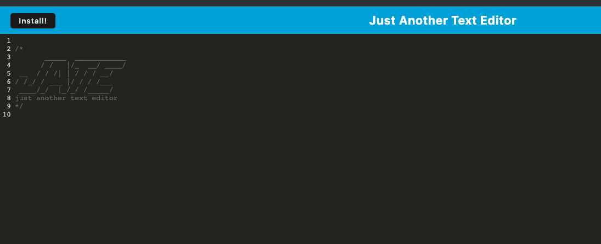

# PWA-Text-Editor

## Description
The goal for this challenge is to build a text editor that runs in the browser. The app is a single-page application that meets the PWA criteria. Additionally, it features a number of data persistence techniques that serve as redundancy in case one of the options is not supported by the browser. The application can also function offline.

## Installation
All dependencies are included and located in package.json. Simply run 
```
npm install
```

## Usage
The live link as deployed on Heroku is <br>
<br>
To run the app from the command line, please refer to the scripts in the package.json.<br>
<br>
<br>
<br>

## Credits

I referenced the Northwestern University full stack curriculum module 19, activity 28 mini project as the source for all of my code in this project.